# 采集设备数据

ThingsLink网关作为物联网平台的数据入口，采集目标设备和系统的数据是最基础核心的功能，下面的步骤以采集一个Modbus仿真设备为例，介绍一下如何通过平台为远程的ThingsLink网关安装应用采集目标设备数据的完整过程。

这里我使用Modbus仿真软件Modsim搭配1个配置文件模拟某个设备。Modbus仿真软件的下载和安装使用请参考[“设备/模拟器”]一节。

ThingRoot平台中，针对设备的数据采集应用多是一对一的对应关系。因此，使用应用采集目标设备数据时，需要先知道目标设备的厂商、型号等信息，然后再去应用商店中按照厂商，型号等过滤条件去查找对应的应用程序，找到应用程序可能不存在（针对此设备的应用未开发）或多个（多个开发者开发了针对此设备的应用）。找不到目标设备对应的应用时，需要自己开发针对目标设备的应用（需要用户掌握ThingsLink应用开发的相关知识），或者委托平台厂商或第三方开发者开发目标设备的应用。

对于一些采用了行业标准协议的设备，平台也提供了一部分适配行业标准协议的通用性应用，这类应用可让用户通过配置面板对应用的参数进行增删改查，还可对设备的IO采集标签及标签参数进行修改。下面以Modbus通用型应用General_Modbus为例来描述一下如何采集一个Modbus仿真器的数据（Modbus仿真器的设备地址，功能码，数据地址及类型等参数非固定）。

测试步骤如下：

1. 启动Modsim32软件。创建虚拟Modbus设备，这里我创建了3个配置页，采用MobusTC协议，运行在502端口。
   配置页1：【设备地址1，03功能码，起始地址1，8个寄存器，4个浮点数】；
   配置页2：【设备地址2，04功能码，起始地址101，10个寄存器，10个整数】；
   配置页3：【设备地址3，01功能码，起始地址201，10个寄存器，10个开关量】
   如下图所示：

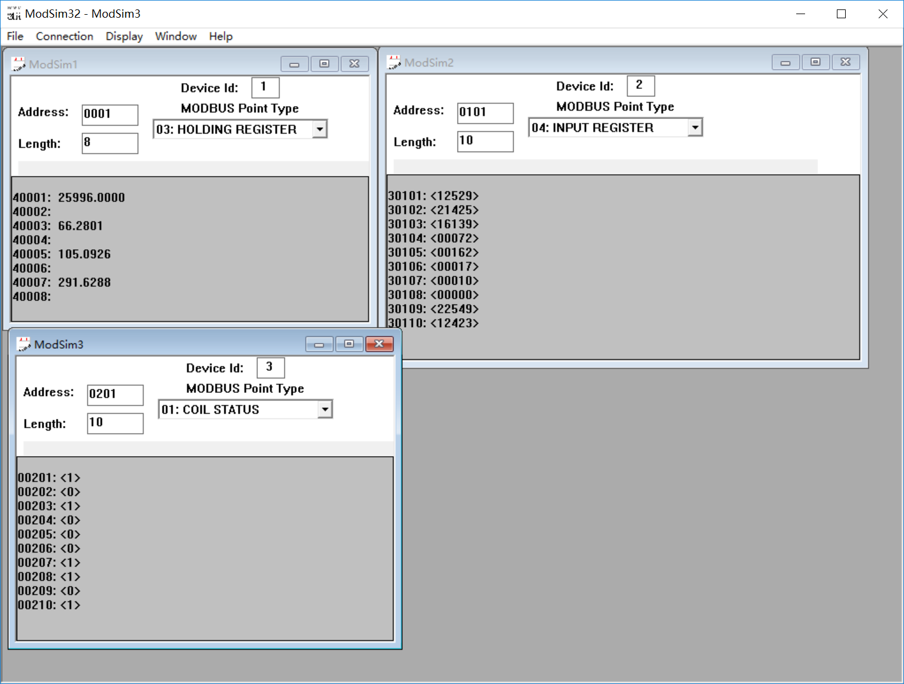

2. 前面的章节已介绍了如何在自己名下增加网关，这里就不再重复，下面安装通用型应用General_Modbus采集步骤1中的仿真设备。在网关应用列表中点击安装新应用按钮，如下图所示：

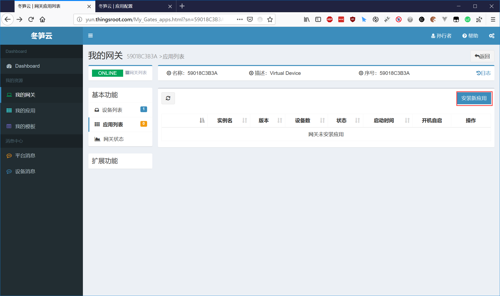

3. 在应用安装页面在通过名称过滤等方式找到General_Modbus应用，如下图所示：

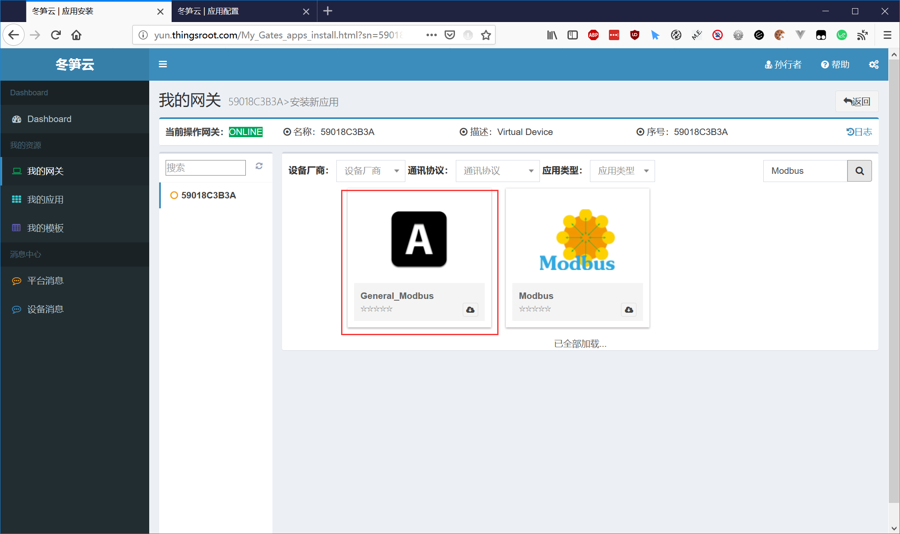

4. 点击安装图标，在新的界面在输入网关中的应用实例名，设置应用的各个参数，本例中使用Mobbus tcp协议和仿真设备通讯，因此通讯协议选“tcp”，链路类型选“socket”，如下图所示：

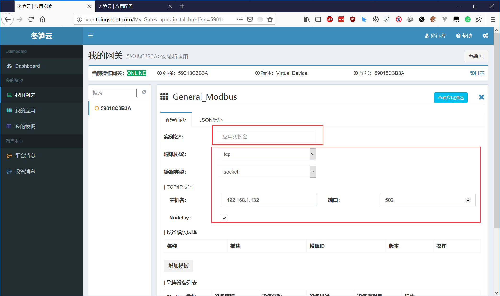

5.  接下来，是添加设备模板和设备，由于模板Modbus仿真设备有3个（设备地址不一样），因此需要添加3个设备，而每个设备的点信息参数不一样，因此，需要3个设备模板。下面通过设备模板中的“添加模板”按钮增加设备模板。如下图所示：

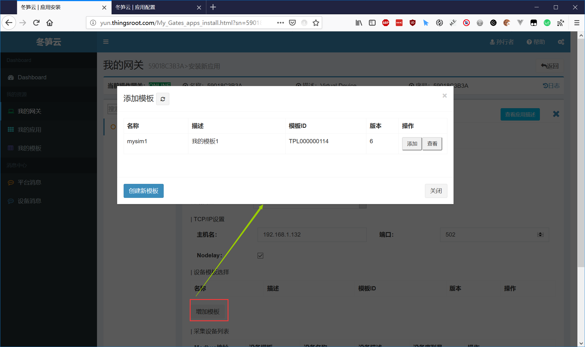

6.  在添加模板界面中，可以看到自己名下已经创建的和当前应用相关的设备模板，如设备模板满足模板设备，那么可以直接使用，如不满足，点击左下角的c创建新模板。在弹出的新窗口中定义新模板的名称描述等信息，如下图所示：
   
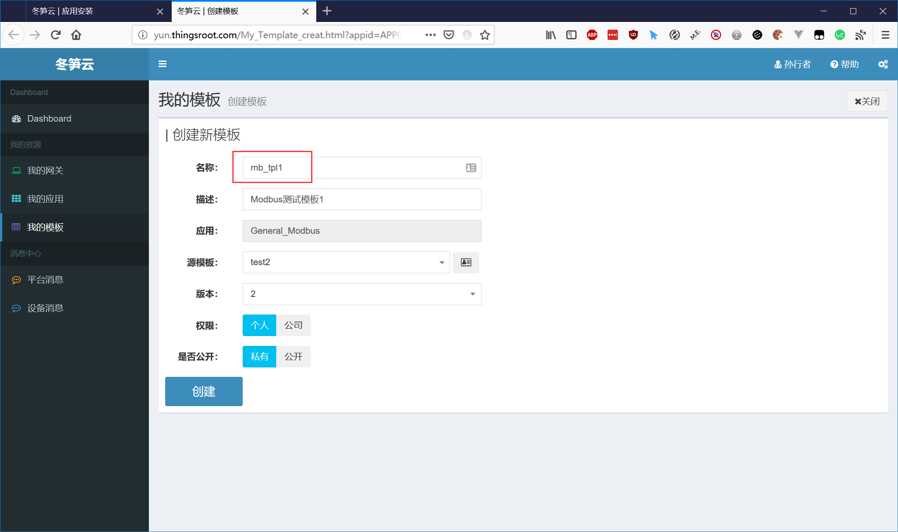   

7. 创建成功后，会进入新模板的详情页面，新模板当前显示的内容来自于应用开发者提供的点表模板，方便使用者编辑点表时参考，点击页面上面的下载图标，可将此点表下载到本地编辑（下载的文件名为"模板名称_版本.csv"），如下图所示：

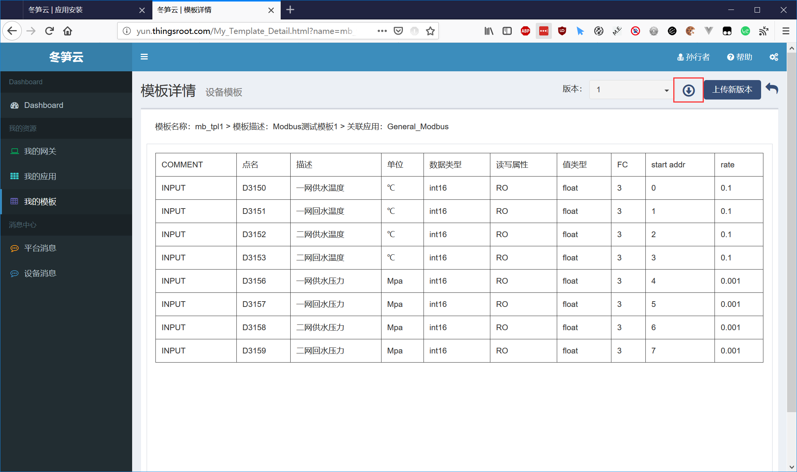   

8. 使用Excel类表格编辑软件打开下载的点表文件，按照点表文件中的格式进行增删改后，依然报文为csv文件格式(UTF-8)，将编辑好的文件保存后，通过页面上的“上传新版本”按钮上传。如下图所示：

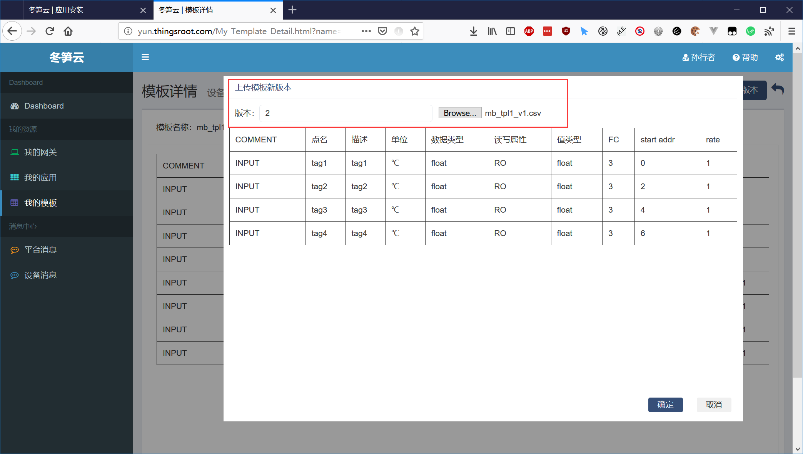  

9. 上传后的新版本。如下图所示：

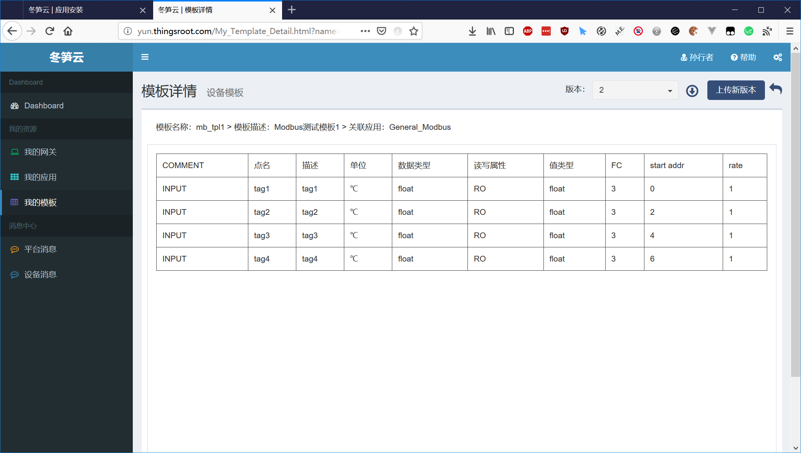  

10. 按照同样的方法，将其他模板也创建出来并上传到平台。完成后可看见自己名下新创建的3个模板。如下图所示：

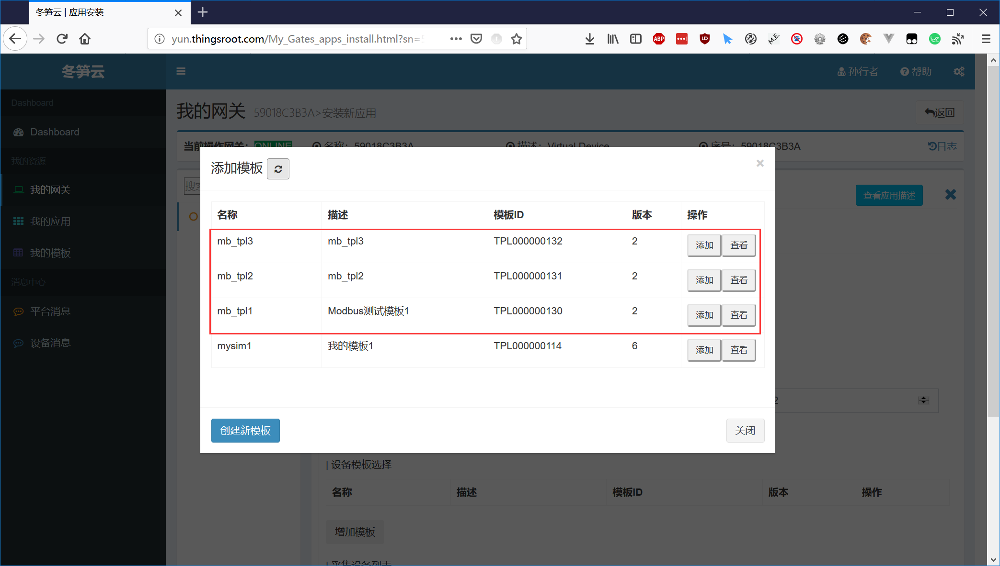  

11. 在3个模板后面点添加按钮，可将选中的模板添加到列表中。如下图所示：

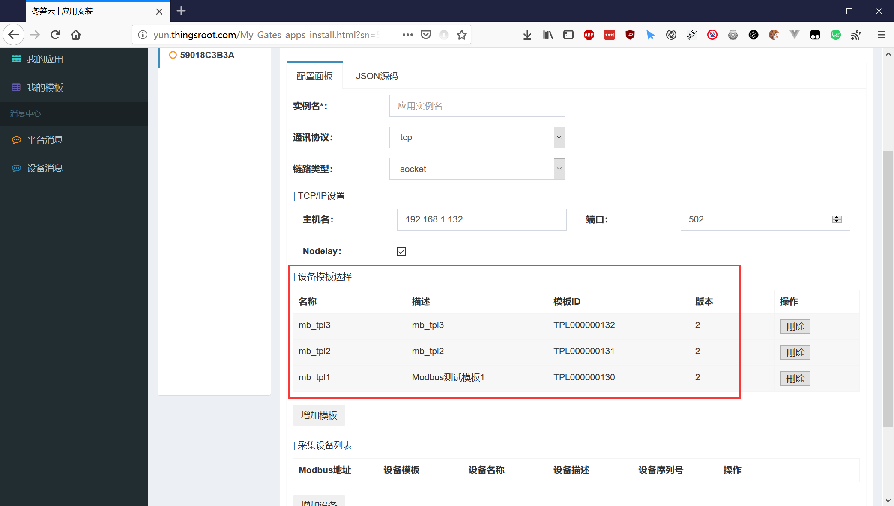  

12. 接下来，我们开始添加设备，仿真设备是3个，我们也添加3个，定义每个设备的Modbus地址，对应的设备模板，定义设备名称，设备描述，以及设备序列号（注意：同一个应用中的设备序列号绝对不能相同，否则会出现数据混乱的情况），定义完成后的配置界面如下图所示：

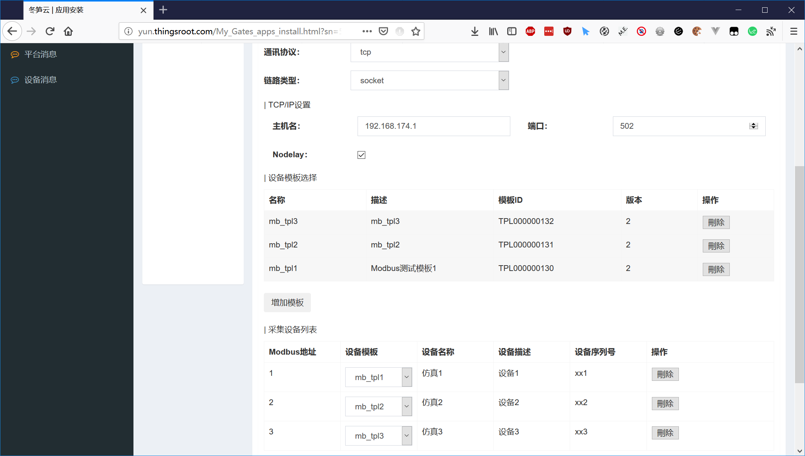  

13. 最后一步是将应用及配置信息下载到网关，就完成了对目标设备采集的安装配置。

14. 接下来，通过数据浏览功能查看应用采集的数据是否正确。