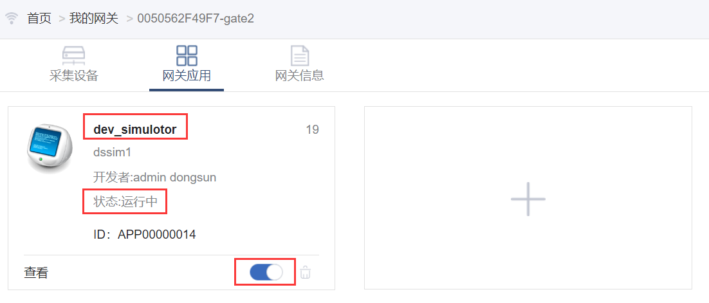

# 为IOT网关增加应用

未使用过的网关是不带任何应用的，也就是说，你如果查看网关的运行状态，那么只能看见网关自身的一些系统变量，而其他的功能（如采集外部的设备数据，通过平台对网关进行IP配置，NTP配置，将数据送到平台等）都是不具有的。如想要网关具有你需要的功能，那么需要从应用商店安装满足你需求的应用。

下面是给网关增加应用的步骤：

1. 在“我的网关”页面选择欲配置的网关，点击“管理”按钮，如下图所示：

   

2. 进入“网关应用”页面后，提示未安装任何应用，点击“安装应用”按钮，如下图所示：   
3. 进入应用商店后，通过应用分类，设备厂商等过滤条件或者输入关键词进行过滤，如下图所示：   
4. 找到合适的应用后，可以通过应用面板上的“应用详情”查看应用的详细信息（如应用功能说明，使用帮助等），如下图所示：    
5. 如想安装应用，可通过“安装应用”按钮进行应用安装界面，如不想安装，点击右上角关闭按钮即可，如下图所示：   
6. 给网关安装应用时，定义的应用实例名称在当前网关中必须唯一。应用配置按照应用的帮助说明填写。如下图所示：   
7. 点击“确定”按钮后，页面会将安装此应用的指令和应用的配置信息发送给指定的网关，网关将安装此应用，并会向客户端返回安装应用的执行结果，如安装完成，会在页面右下角提示安装成功或失败的信息，等待网关返回执行结果的时间是20秒，如20秒内无返回，则提示超时。
8. 应用安装成功后，在“网关应用”就会看见刚安装的应用，并回显示应用在网关中的名称、应用版本号、运行状态、是否开机自启动、查看应用状态等信息。如下图所示：   
9. 至此，给网关安装应用的过程如上所述，按照此步骤可以给网关安装更多的应用。  

