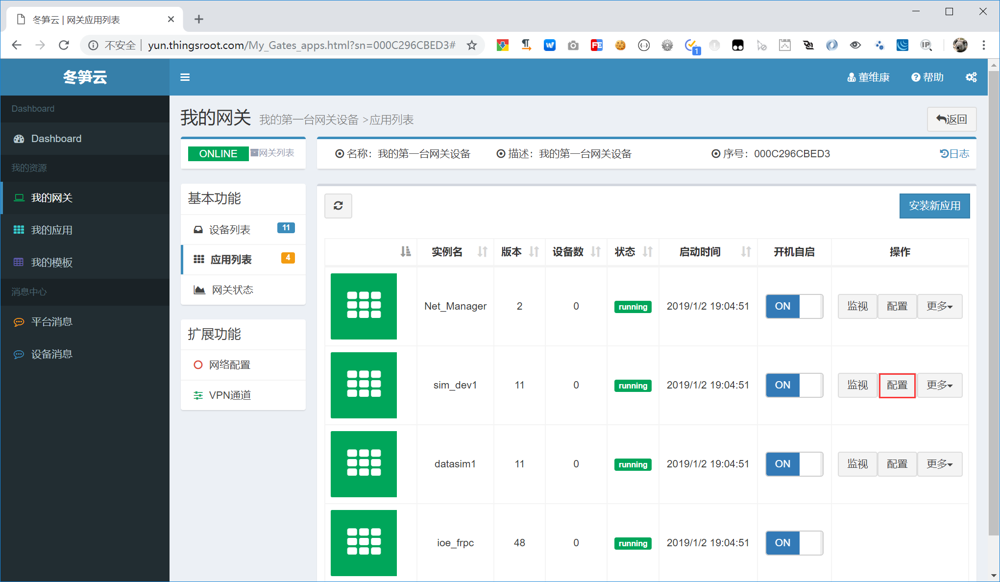
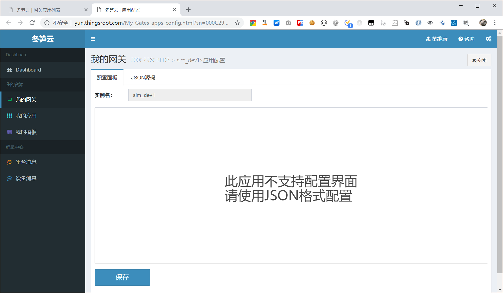
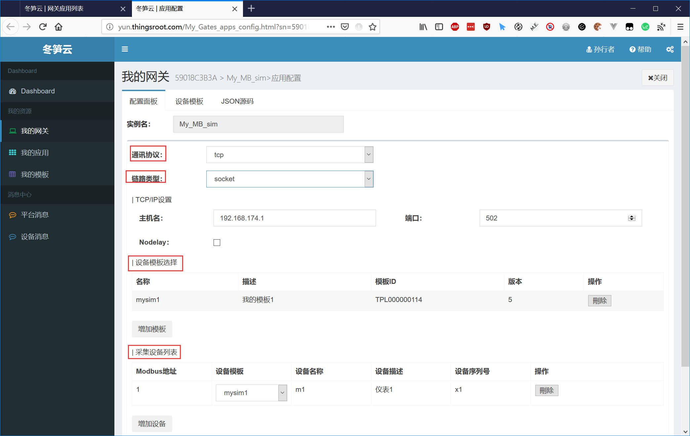
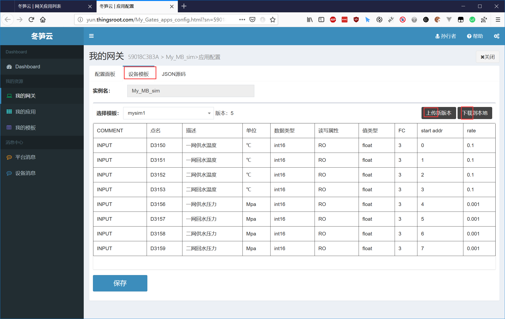
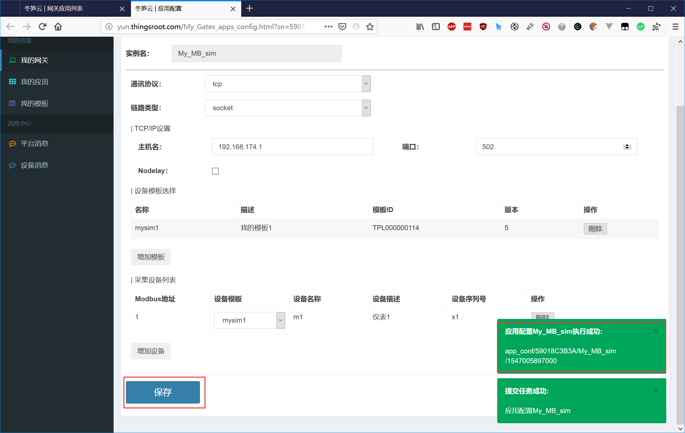

# 修改IOT应用配置

网关中的应用在使用过程中会根据实际的需要（环境变化，应用升级，配置错误等原因）调整应用的配置，如需修改应用的配置信息，在网关应用应用列表中点击应用右侧的“配置”按钮，如下图所示：

点击页面中的配置按钮后，会弹出一个新的窗口，新窗口就是应用的配置界面，如下图所示：

FreeIOE的应用中，并不是所有的应用都有配置界面，是否需要配置界面，是由应用开发者决定的。一些简单或专用的应用，目的是为了使用更方便和快捷，就没有提供配置界面了，而对于功能多且配置选项繁多的通用性应用，就会需要配置界面了，如Modbus数据采集应用，Modbus数据采集应用的配置面板如下图所示：

Modbus数据采集应用除了提供应用参数面板，还提供了设备模板的查看和上传功能。如下图所示：

通过应用提供的帮助，修改应用参数或更新设备模板后，点击“保存”按钮即可将新的应用配置信息下载到目标网关中并立刻生效。如下图所示：
