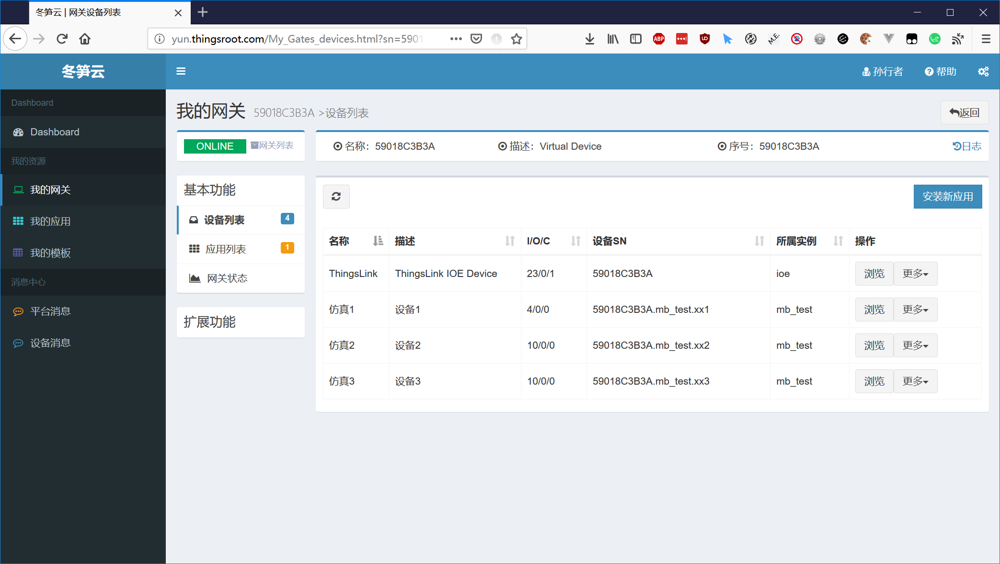
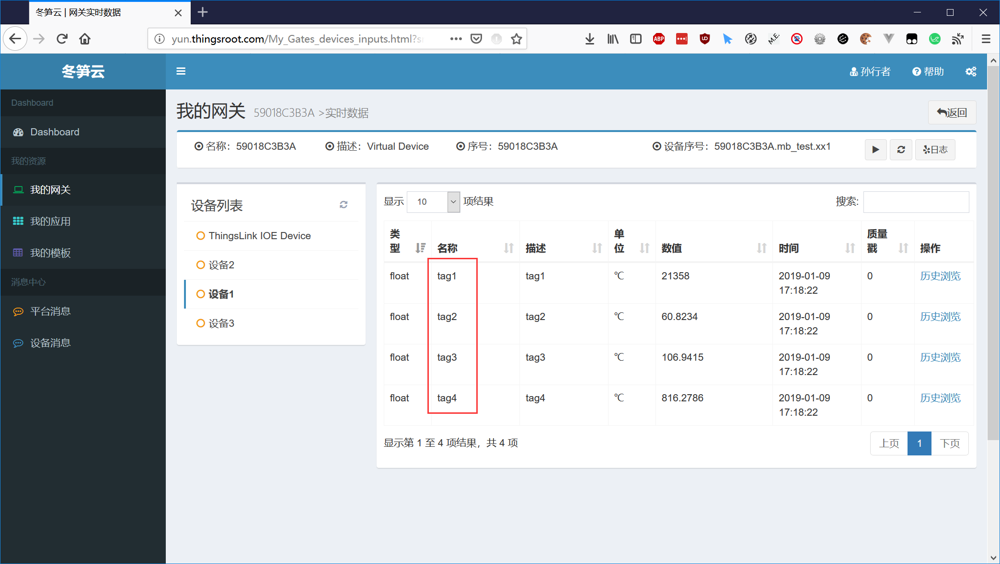
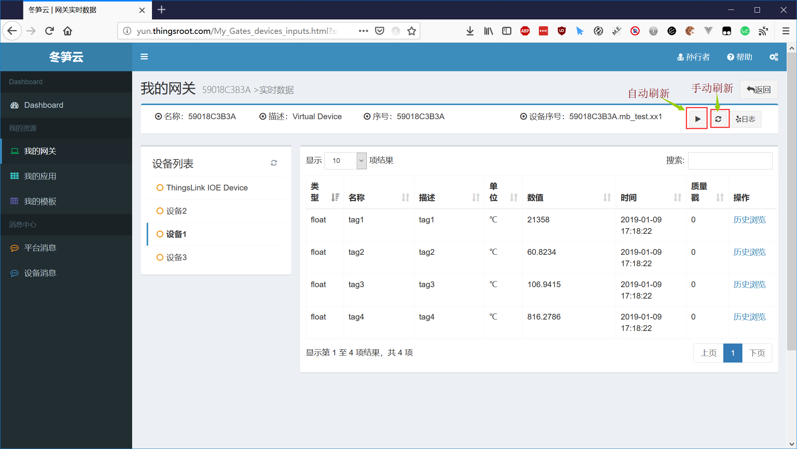
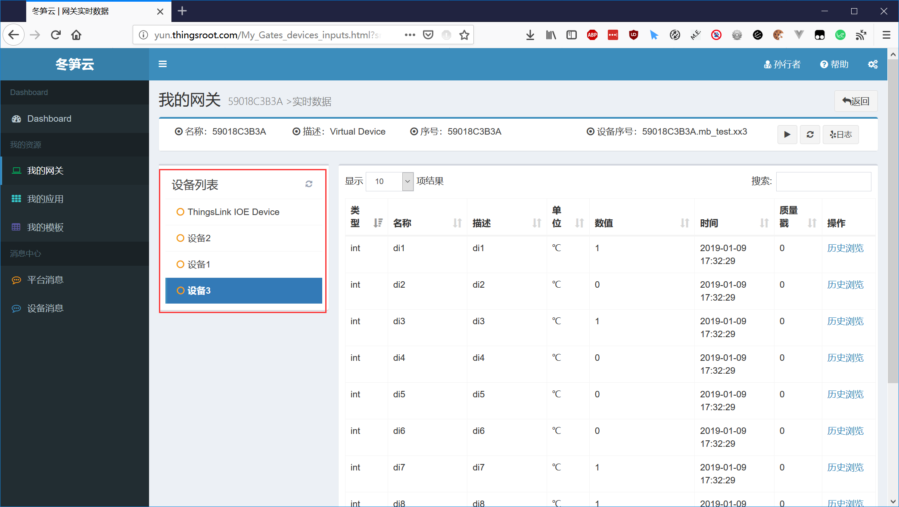

# 浏览采集的数据

在目标网关的配置管理界面中，默认提供了“设备列表”，“应用列表”，“网关信息”等功能，其他功能需要安装在网关中安装扩展应用进行扩展。本节主要介绍查看网关采集到的设备数据。在网关的配置管理界面上点击“采集设备”，就可查看网关采集设备数据的情况。

应用安装完成后，切换到网关的设备列表，可以看到设备中所有的设备，这些设备是由FreeIOE及FreeIOE的应用创建出来的设备对象。通过设备对象提供的功能按钮，可以查看设备变量的实时数据，历史数据，以及对设备进行数据下置或指令下置等操作。

这里，我们演示一下如何查看上一节中采集的3个Modbus仿真设备的数据。

1) 进入目标网关的管理界面，切换到“设备列表”，可以看见我们上节中添加的3个仿真设备，如下图所示：

  

2) 点击某个设备(如仿真1设备)后面的浏览按钮，可进入设备实时数据浏览页面。如下图所示：

3) 在在界面中，我们可看到仿真1设备的实时数据，此页面的数据默认不是自动实时刷新的。需要点击右上方的“开启自动刷新”按钮来开启实时刷新，或者通过“单次刷新”按钮来手动刷新。如下图所示：

4) 点击“自动刷新”图标后，页面会周期性（默认3秒）的从服务器获取当前设备的实时数据，再次点击此按钮，会停止自动刷新。

5) 点击页面右侧的“设备列表”，可切换不同设备查看实时数据。如下图所示：

