# 为IOT网关增加应用

未使用过的网关是不带任何应用的，也就是说，你如果查看网关的运行状态，那么只能看见网关自身的一些系统变量，而其他的功能（如采集外部的设备数据，通过平台对网关进行IP配置，NTP配置，将数据送到平台等）都是不具有的。如想要网关具有你需要的功能，那么需要从应用商店安装满足你需求的应用。

下面是给网关增加应用的步骤：

1. 在“我的网关”页面选择欲配置的网关，点击“应用”按钮，如下图所示：

   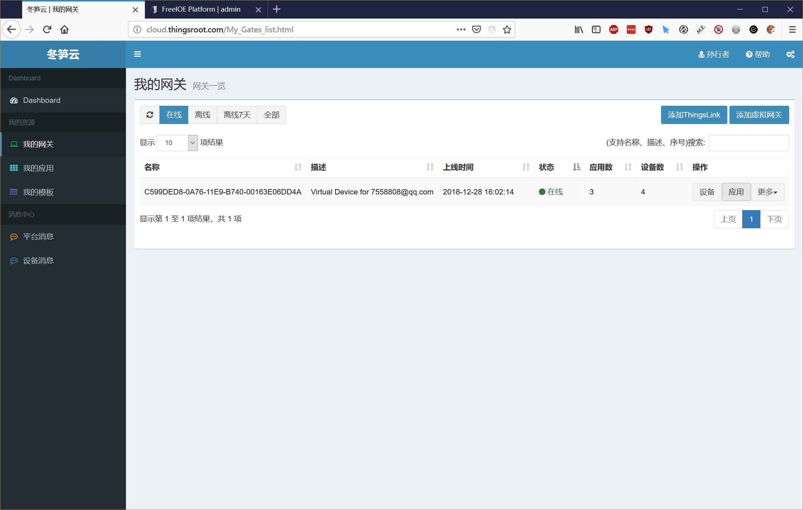

2. 进入“网关应用”页面后，提示未安装任何应用，点击“安装应用”按钮，如下图所示：  
    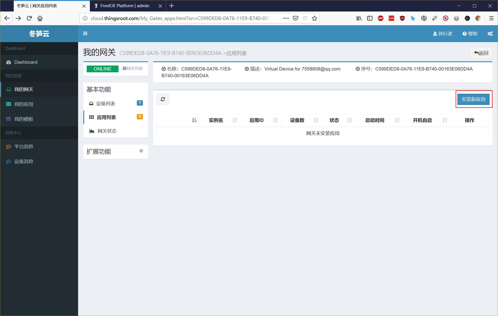 

3. 进入应用商店后，通过应用分类，设备厂商等过滤条件或者输入关键词进行过滤，如下图所示：  
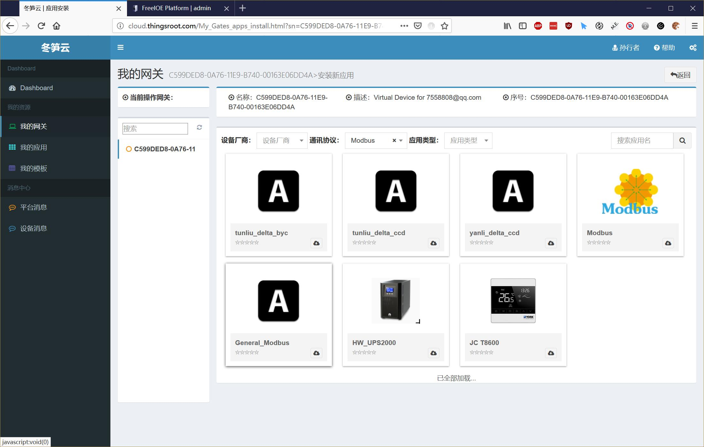 
4. 找到需要的应用后，点击应用查看应用的详细信息（如应用功能说明，使用帮助等），如下图所示：   
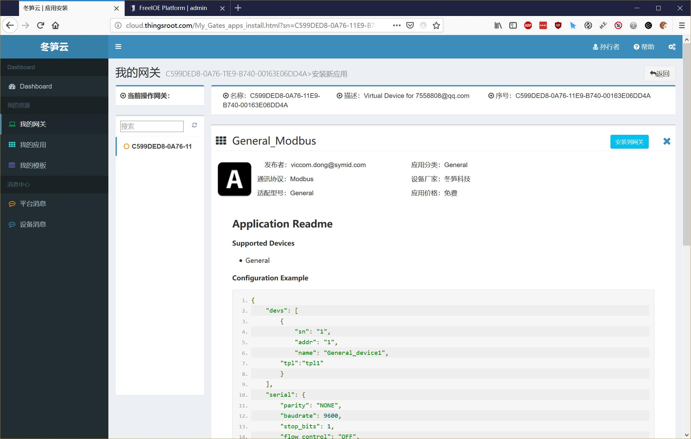 
5. 如想安装应用，可通过“安装到网关”按钮进行应用安装界面，如不想安装，点击右上角关闭按钮即可。
6. 给网关安装应用时，定义的应用实例名称在当前网关中必须唯一。应用配置按照应用的帮助说明填写。如下图所示：  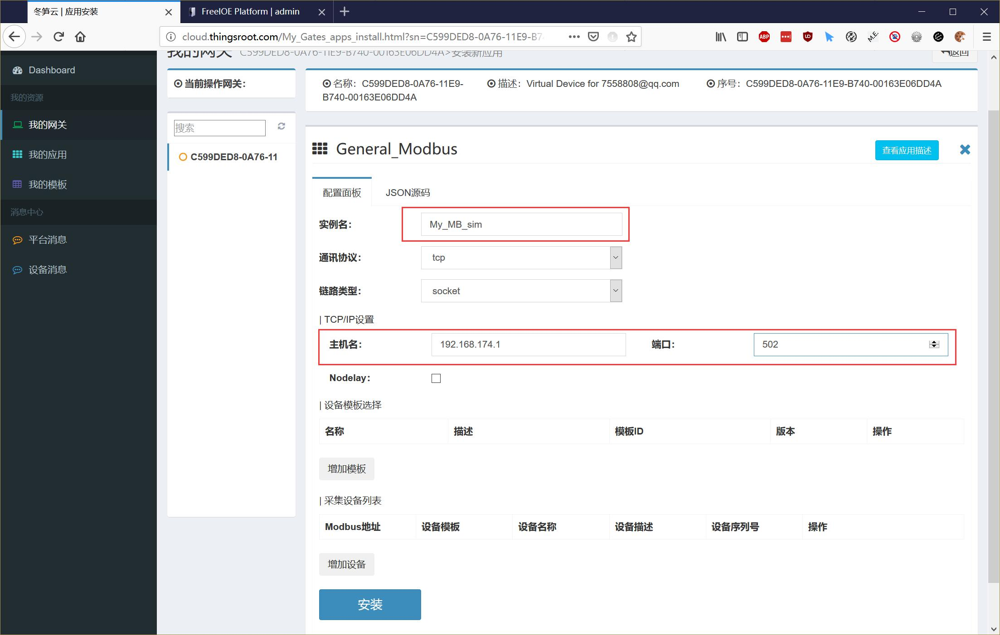 
7. FreeIOE的应用有些带应用配置界面，有些无需配置界面，对于无配置界面的应用，只需要定义应用在网关中的运行实例名即可；对于带配置界面的应用，所需的配置项各不相同，因此需要仔细阅读应用自己提供的使用说明。对本例安装的General_Modbusy应用来说，它支持协议选择，链路选择，链路参数配置，还支持用户自定义的点表文件，支持采集多个Modbus设备等功能。
8. 安装General_Modbusy应用，我们需要给此应用添加设备模版，点击页面中的增加模板按钮，在弹出的面板在选择自己需要的设备模板，如下图所示：
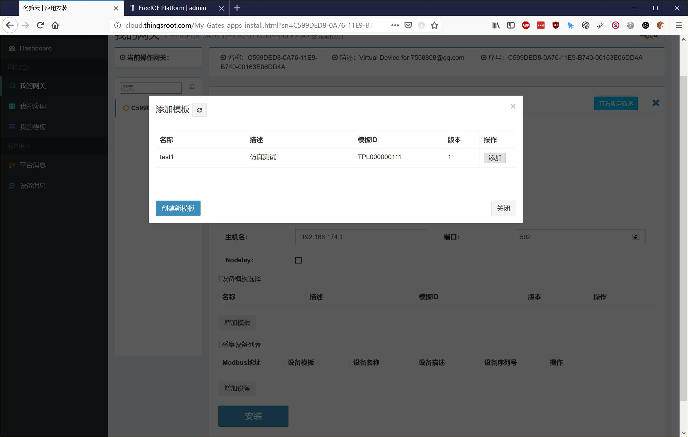 
9. 在设备模板中没有自己需要的设备模板，我们可以点击“创建新模板”按钮来创建此应用的设备模板，点击“创建新模板”按钮后，会在新窗口中弹出创建模板的页面，如下图所示：
    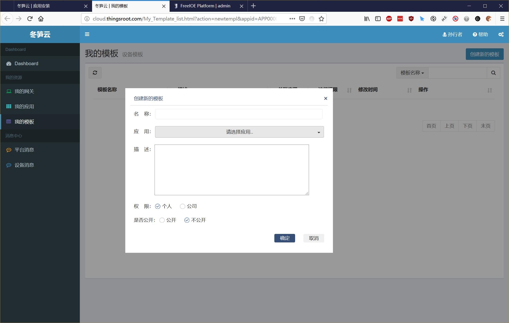 
10. 给新建的设备模板定义名称，选择对应的应用，如应用带有模板实例，选择一个模板文件和文件版本，定义模板描述，权限等，点击“确定”按钮创建自己的模板。如下图所示：
   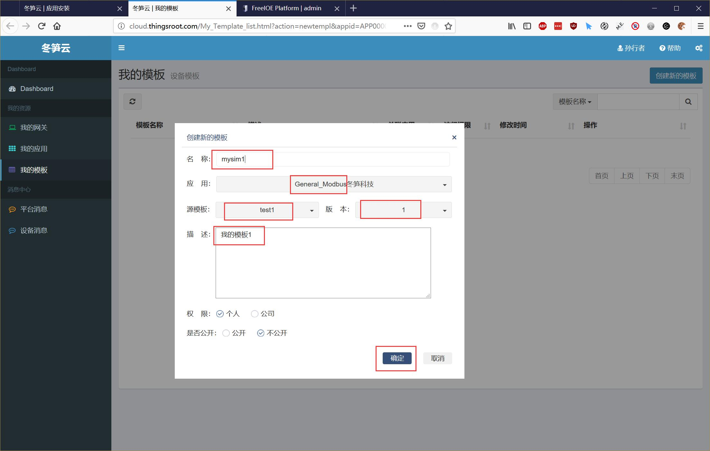
11. 模板创建完成后，目前的模板不是自己想要的点表，因此还得继续进行模板操作，通过查看模板→下载模板→编辑模板→上传模板这几步后，就可以得到自己需要的设备模板了。点击“查看”按钮进行模板查看页面，如下图所示：
 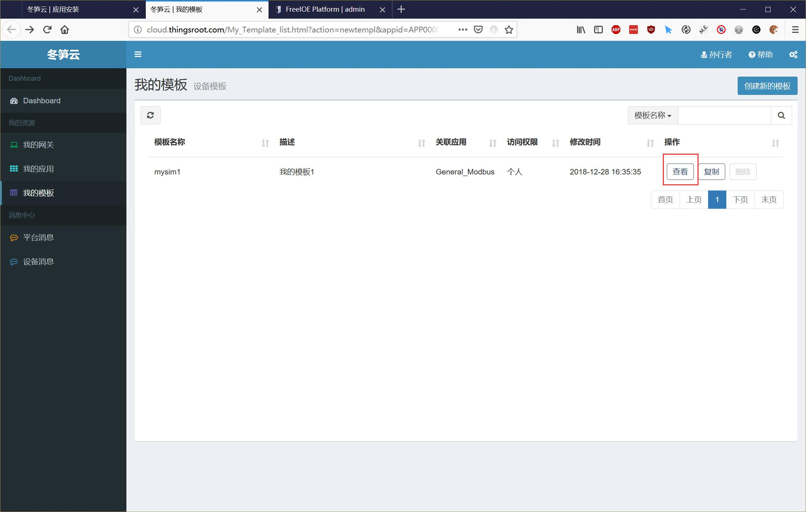
12. 在模板查看页面中可以查看到示例点表文件的格式，如下图所示：
    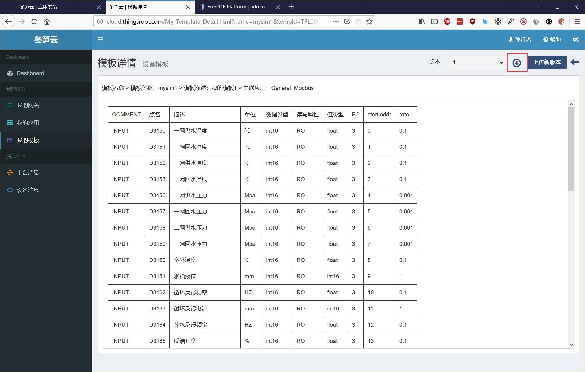
13. 在模板查看页面中点击下载按钮，会将此模板的实例模板下载到本地，下载的文件是UTF-8编码的CSV文件，可使用Office Excel等电子表格软件打开编辑，如下图所示：
    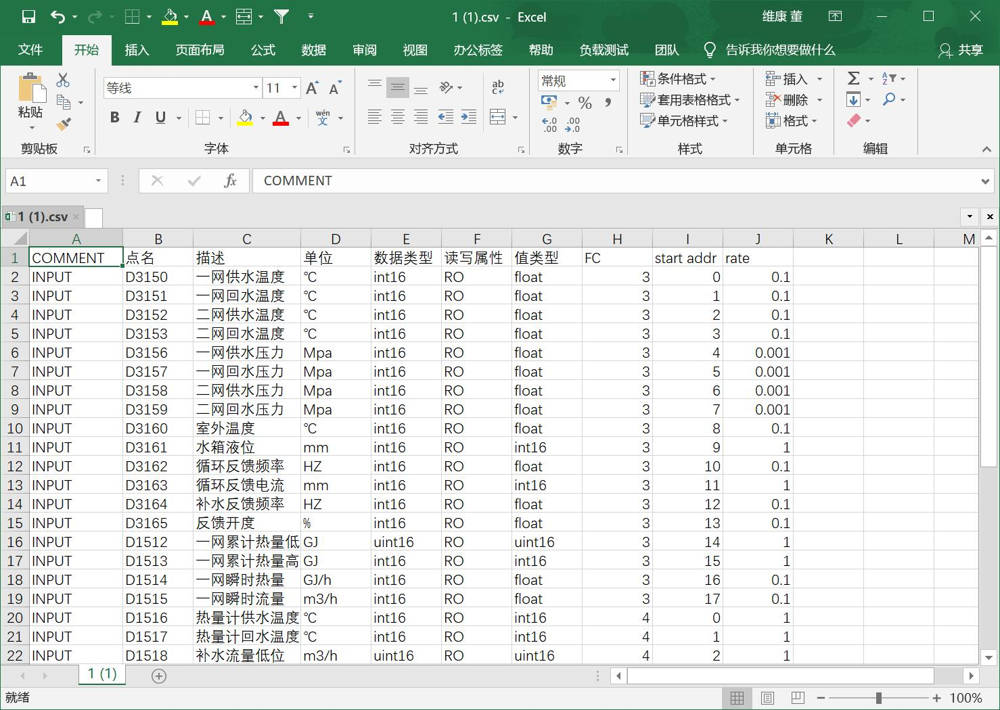
14. 编辑完成后，将CSV文件保存为UTF-8编码的CSV文件，Excel保守时提示如下图所示：
    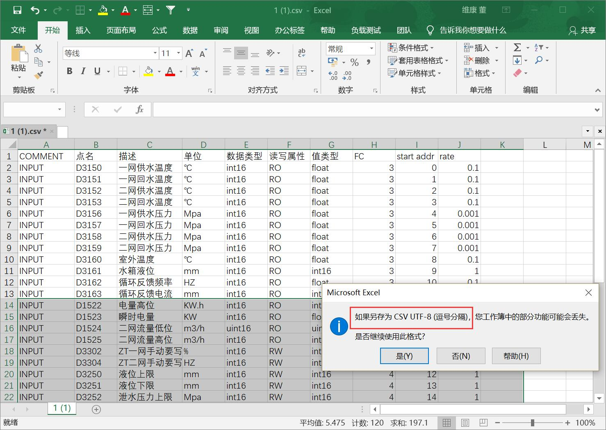
15. 将编辑好的文件通过模板查看页面中的“上传新版本”按钮上传即可，如下图所示：
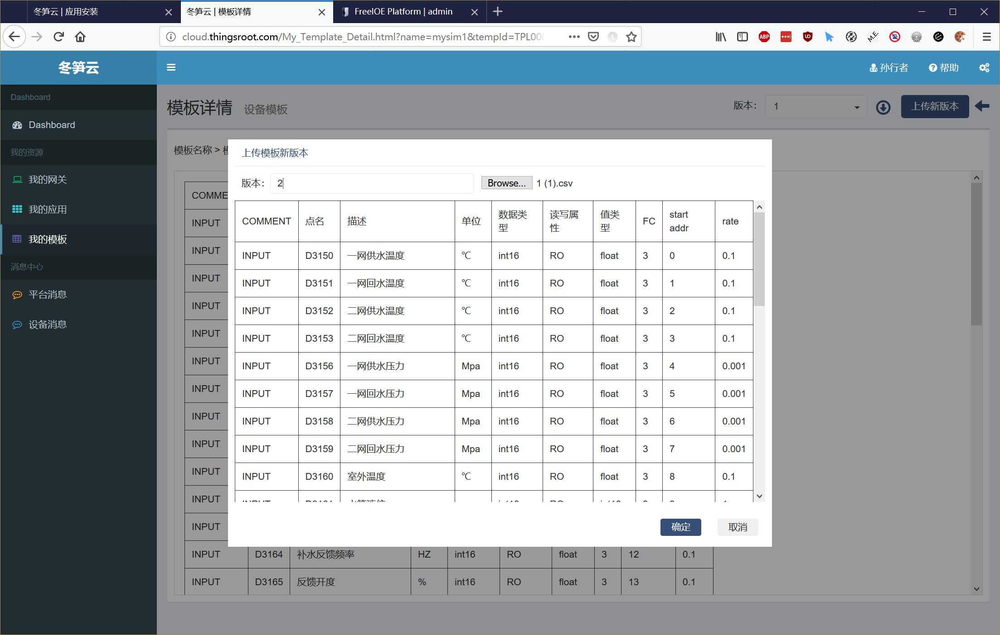
16. 返回到应用安装界面，点击添加模板中的刷新按钮，刚刚添加的设备模板就出现在选择列表中，如下图所示：
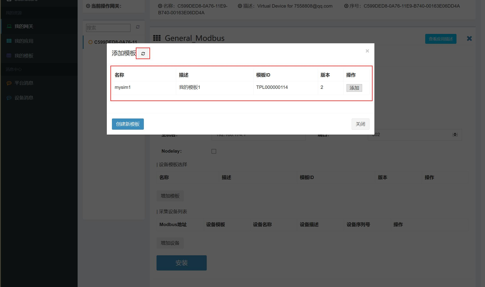
17. 模板照此方法添加后，在下面的设备列表中点击“添加设备”按钮添加此应用要采集的设备。如下图所示：
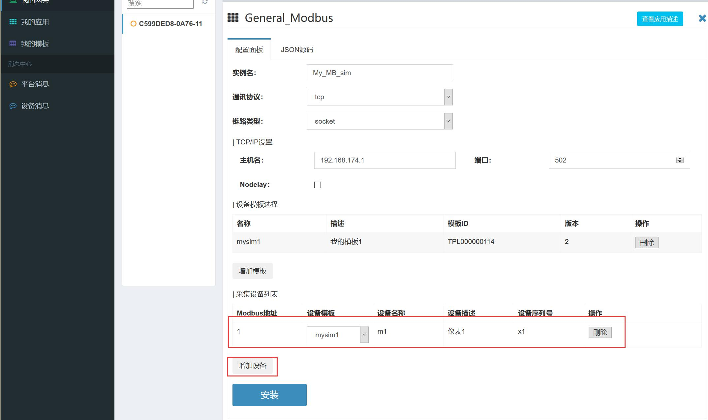
18. 点击“安装”按钮，会将安装此应用的指令和应用的配置信息发送给指定的网关，网关将安装此应用，并会向客户端返回安装应用的执行结果，如安装完成，会在页面右下角提示安装成功或失败的信息，等待网关返回执行结果的时间是20秒，如20秒内无返回，则提示超时。
19. 至此，给网关安装应用的过程如上所述，按照此步骤可以给网关安装更多的应用。  
