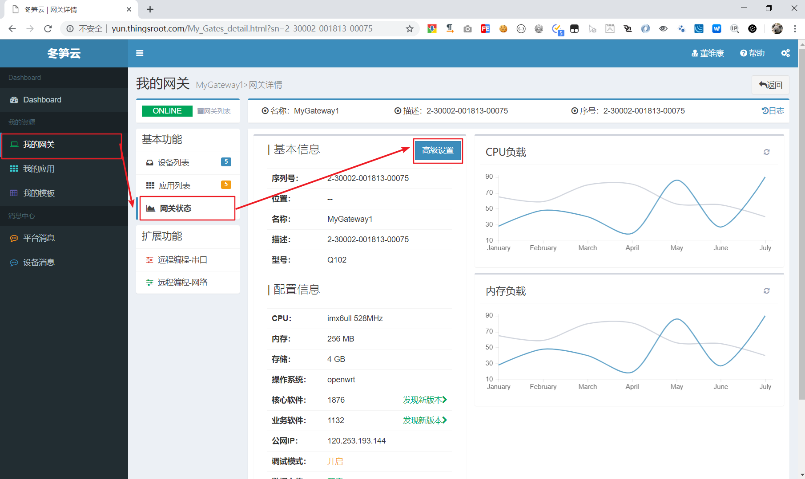
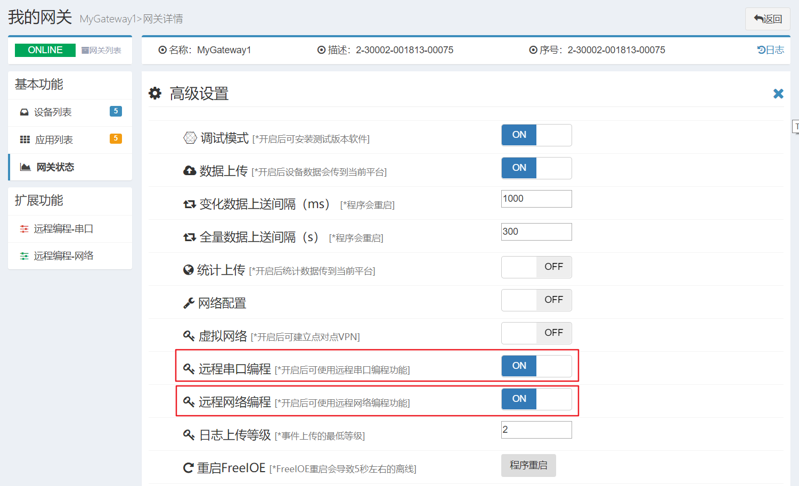

# 工业设备远程编程

工业设备远程编程是freeioe为用户提供的一项非常实用的功能，通过ThingsCLoud平台在边缘计算网关中安装远程编程应用后，用户就可将远程边缘计算网关连接的工业设备（如PLC，控制器，或任何智能仪表）虚拟到用户的计算机上，用户通过工业设备厂商提供的编程软件或者配置软件对现场设备进行全功能的操作，和设备在本地使用的感觉完全一样。

freeioe提供的工业设备远程编程技术使用云端节点作为高速中转节点，现场网关和用户电脑建立的是一对点对点的隔离隧道，现场网关和用户电脑之间传输的数据是TLS加密且压缩的，用户无需担心报文被监听或截获。而点对点模式构建的虚拟串口或者虚拟网络，也让用户使用过程更加的简单和高效。

#### 使用须知

1. freeioe的远程编程功能是在freeioe边缘计算应用开发框架上实现的，因此远程编程功能离不开安装了freeioe软件的网关和提供管理操作的ThingsCloud平台。因此用户需要在ThingsCloud平台上注册自己的账户，并使用安装了freeioe软件的网关连接现场设备，还须让网关连接到ThingsCloud平台。
2. 远程编程是在freeioe V1141版本之后开发的，因此现场网关的freeioe版本必须升级到V1141版本或更新版本。
3. 远程编程的所有操作都是通过ThingsCloud平台完成，但这并不是说freeioe的远程编程无需在用户电脑中安装软件了，由于需要在用户的Windows系统中创建虚拟网卡和虚拟串口，因此需要用户在使用远程编程功能时安装freeioe_Rprogramming软件，这个软件可通过平台的操作页面上按照提示安装下载。也可在此帮页面的最后下载。
4. 需要说明的是freeioe的远程编程用户端软件仅仅支持Windows 7/8/10 操作系统，也支持Windows Server 2008/2012/2016 操作系统。理论上也支持微软后期的Windows 系统。以上的操作系统32位和64位都可支持。
5. freeioe的远程编程功能默并未内置到freeioe中，因此用户必须通过ThingsCloud平台去开启网关的远程串口编程和远程网络编程功能，实际上非常简单，只需通过ThingsCloud平台选择网关后，在网关状态页面中的高级设置中就可开启这两项功能。

#### 如何开启

1. 用户登录平台后，选择希望开启远程编程功能的网关。进入网关状态页面，如下图所示：
   

2. 在高级设置面板中开启“远程串口编程”或“远程网络编程”即可，如下图所示：

#### 下载链接：
freeioe远程编程软件[http://thingscloud.oss-cn-beijing.aliyuncs.com/download/freeioe_Rprogramming.zip]

