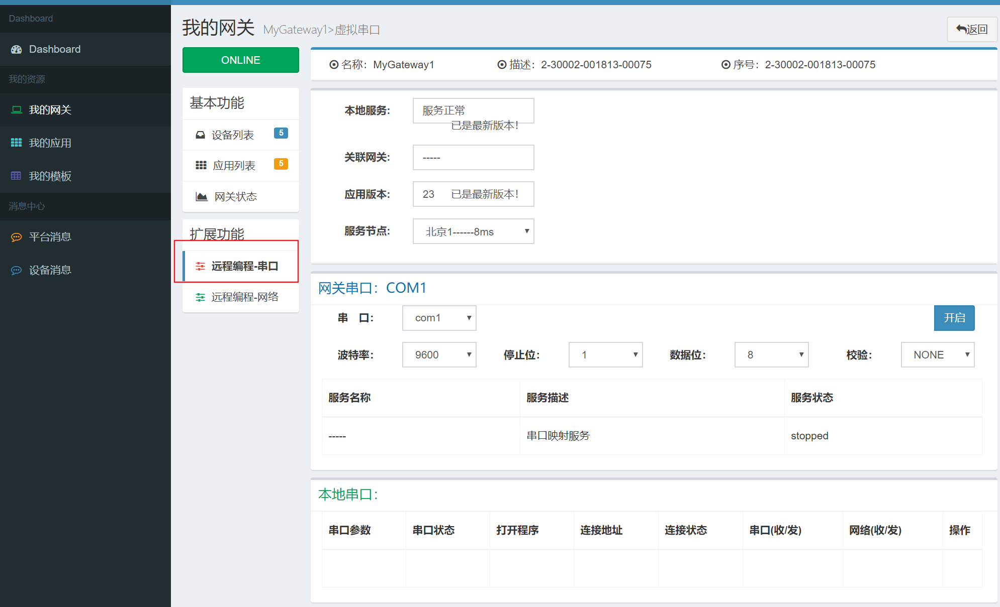
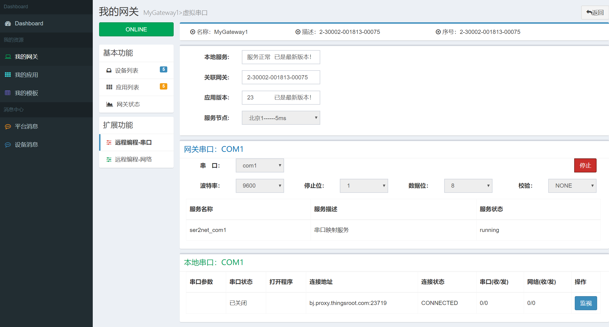

# 虚拟串口

虚拟串口是将远程网关的某个物理串口映射到本地计算机的一个虚拟串口，在本地计算机虚拟出来的虚拟串口对应用程序来说，和本机的其他物理串口没有任何区别。因此用户在使用工业设备的编程软件访问本机的虚拟串口时，实际就是访问远程设备的串口。

freeioe的虚拟串口编程功能使用如下：

1. 当网关开启远程串口编程后，在当前网关的二级导航中就可看见“远程编程-串口”的菜单，点击“远程编程-串口”菜单，进入到“远程编程-串口”页面，页面载入后如下图所示：

2. 页面中的各项说明如下：

| 字段名称  | 说明 |
| ------------- | ------------- |
| 虚拟串口服务关联网关  | 本机虚拟串口关联的远程网关序列号  |
| 网关串口  | 本机虚拟串口关联的远程网关串口及参数  |
| 本地串口  | 本机虚拟串口的名称及相关参数  |
3. 如本机的freeioe_Rprogramming软件已经安装并启动，页面打开时会自动连接到服务并可正常使用，如本机的freeioe_Rprogramming服务未启动，页面将出现提示如下图所示：

4. 选择网关串口并设置相关参数后，点击右侧的开启按钮即可启动和远程网关串口的映射，虚拟串口创建成功后的页面如下图所示：

5. 接下来就可使用编程软件访问本机的虚拟串口，虚拟串口的编号在本地串口处有显示，编程软件打开本地的虚拟串口后，在下方的表格中将显示相关参数，各个参数的说明如下表

| 字段名称  | 说明 |
| ------------- | ------------- |
| 串口参数  | 本机虚拟串口当前的工作参数  |
| 串口状态  | 本机虚拟串口当前的工作状态  |
| 打开程序  | 打开本机虚拟串口的程序名称  |
| 连接地址  | 远程的主机地址和端口  |
| 连接状态  | 和远程主机的连接状态  |
| 串口(收/发)  | 本机虚拟串口收发的字节数  |
| 网络(收/发)  | 和远程主机收发的字节数  |
| 操作  | 监控此虚拟串口的收发报文  |

6. 通过虚拟串口的监控功能，可以截获串口上的报文并以十六进制字符显示。如下图所示：

