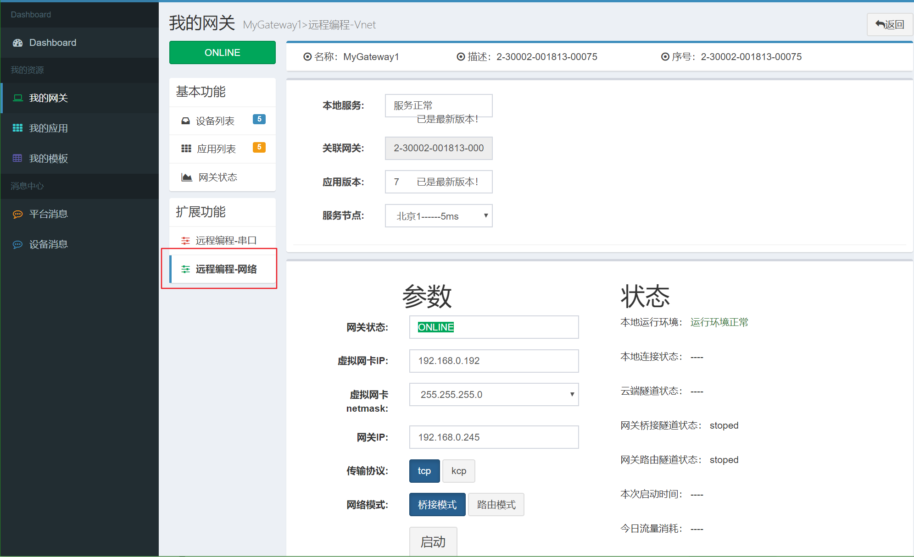
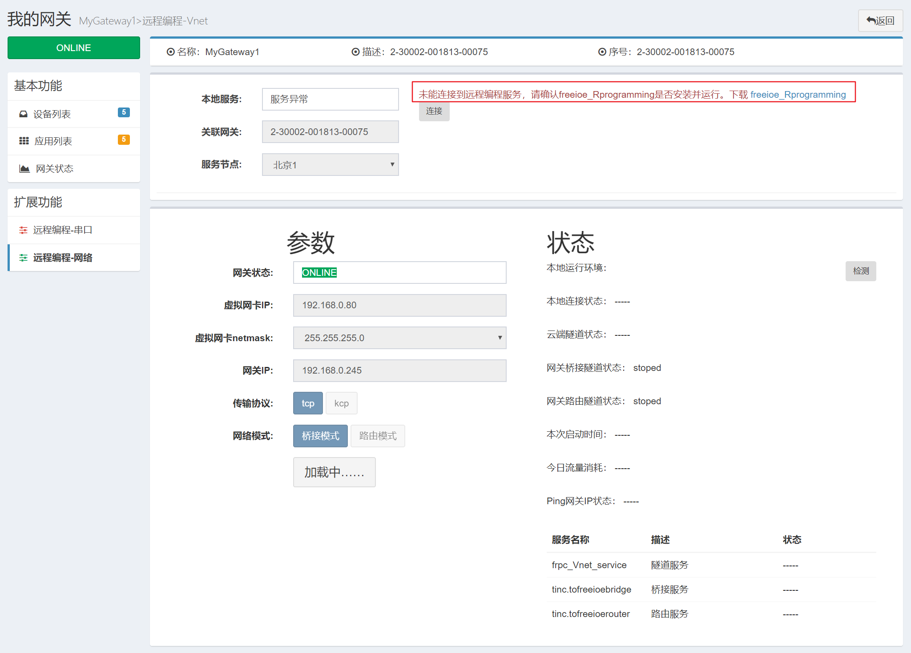
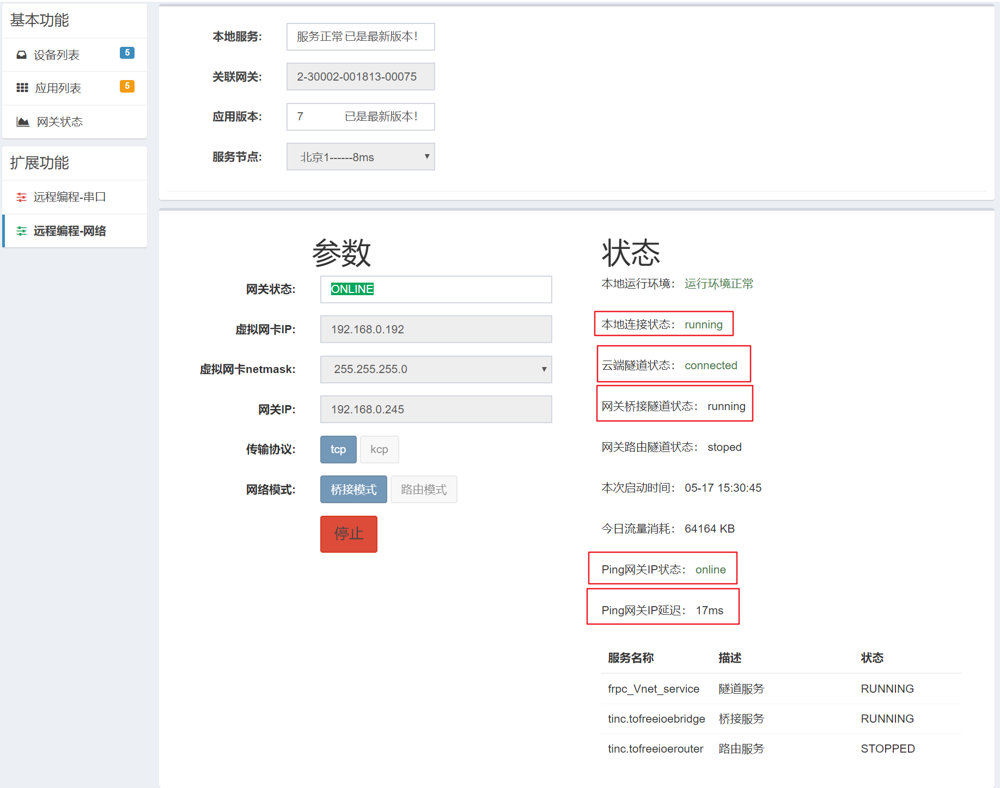

# 虚拟网络

虚拟网络是将远程网关设备作为一个交换机或路由器，将本地电脑和远程的网络设备连接到一个网络中。
如选择桥接模式，则将远程网关设备作为一个虚拟交换机，将本地PC电脑和远程设备都接到了同一个交换机上，将本地PC电脑的IP地址设置和远程设备的IP在同一网段，那么本地PC电脑就如同在本地局域网一样访问远程的设备了。
如选择路由模式，则将远程网关设备作为一个路由器，将本地PC电脑和远程设备都接到了这台路由器的2个网口上，本地电脑和远程设备通过这台虚拟的路由器交换数据，在这种模式下，必须让现场的工业设备的默认网关IP地址设置为现场网关的LAN口IP地址。

freeioe的虚拟网络编程功能使用如下：

1. 当网关开启远程网络编程后，在当前网关的二级导航中就可看见“远程编程-网络”的菜单，点击“远程编程-网络”菜单，进入到“远程编程-网络”页面，页面载入后如下图所示：

2. 只有远程网关在线和本地freeioe_Rprogramming服务正常启动的情况下，远程网络编程才可正常使用，本地freeioe_Rprogramming服务未启动的时候页面如下所示：

3. 选择云端节点(当前只有1个)，设置本地虚拟网卡的IP地址，选择传输协议和网络模式后，点启动即可。成功后如下图所示：

4. 页面中的设置参数及状态字段描述如下表：

| 字段名称  | 说明 |
| ------------- | ------------- |
| 服务节点  | 云端服务节点  |
| 网关状态  | 操作的网关是否在线  |
| 网关SN  | 操作的网关的序列号  |
| 虚拟网卡IP  | 为本机的虚拟网卡设置IP地址或指定远程网络的网段  |
| 虚拟网卡ｎｅｔｍａｓｋ  | 本地虚拟网卡的子网掩码或远程网络的子网掩码  |
| 网关IP  | 远程网关连接内网网卡的IP  |
| 传输协议  | 默认ＴＣＰ，可选KCP加速  |
| 网络模式 | 桥接模式／路由模式  |
| 本地运行环境  | 检测本地运行环境是否正常  |
| 本地服务状态  | 检测本地服务是否正常  |
| 本地连接状态  | 虚拟网络工作时本地连接的状态  |
| 云端隧道状态  | 虚拟网络工作时云端隧道的状态   |
| 网关桥接隧道状态  | 远程网关桥接服务的状态  |
| 网关路由隧道状态  | 远程网关路由服务的状态  |
| 本次启动时间 | 本次启动虚拟网络的时间  |
| 今日流量消耗  | 当天消耗的总流量统计  |
| ｐｉｎｇ网关IP状态  | ｐｉｎｇ远程网关IP地址的结果  |

5. 当关闭此页面，再次进入此页面时，如果上次的远程网络编程功能并停止，那么此页面会显示上次的配置。
